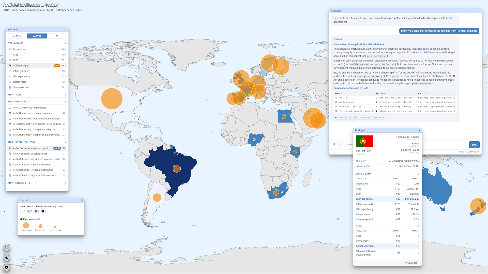

# AI Geo - Portugal's ANIA in Comparative Perspective



**AI Geo** is an interactive map application for the comparative study of national
**Artificial Intelligence agendas** and their relationship to **social cohesion**. It takes
Portugal's **ANIA** - the *Agenda Nacional para a Inteligência Artificial* (National
Artificial Intelligence Agenda) - as its focal subject and sets it side by side with the AI
strategies of other countries, scored on a common, transparent rubric.

The goal is to move the conversation about national AI policy beyond rhetoric: rather than
asking *whether* a country mentions fairness, inclusion, or oversight, the project measures
*how far each commitment has actually been operationalised* - from a stated principle, to a
named initiative, to a quantified, institutionalised, or legally anchored measure.

---

## What is being compared

Each national AI agenda is assessed across the **four course-defined aspects** most relevant
to social cohesion:

1. **AI and Jobs** - labour-market disruption, reskilling, worker voice, and economic outcomes.
2. **AI and Democracy** - participation, oversight, transparency, and defence of the information ecosystem.
3. **AI and Social Cohesion** - the project's focal lens: fairness, language, territory, and inclusion.
4. **AI Ethics and Human Development** - sovereign capability, openness, enforceable rules, and human-development alignment.

Within each aspect, the agenda receives a **composite score (0-3)** plus **five
sub-indicator "pillars" (0-2 each)**. The four categories come from the course framing; the
**pillar set and the scoring rubric are the analytical contribution of this work**. The full
rationale, the pillar-selection criteria, and the per-level definitions are documented in
[`data/ai_agendas/ania_pillars_rationale.md`](data/ai_agendas/ania_pillars_rationale.md),
with the indicator reference and the complete value matrix in
[`data/ai_agendas/ania_reference.md`](data/ai_agendas/ania_reference.md) and
[`data/ai_agendas/ania_matrix.csv`](data/ai_agendas/ania_matrix.csv).

**Coverage.** The corpus comprises **23 countries** (with **Portugal** as the focal subject),
and a **10-country shortlist** used in the final report. To situate the agendas in their
wider context, the app also carries **World Bank development indicators** (population, area,
GDP, GDP per capita, infant mortality, life expectancy, literacy rate, unemployment).

---

## What you can do with the application

AI Geo is a single-page, full-screen world map with floating panels. For reviewers and
first-time visitors, here is what to expect:

- **Choropleth map.** Pick any indicator (ANIA or World Bank) and the world is shaded by
  value. ANIA's ordinal scores render as clean discrete steps; continuous World Bank metrics
  use a graded ramp.
- **Two indicators at once.** Select a second indicator and it is drawn as **proportional
  bubbles** over the colour layer - so you can read, for example, *GDP per capita* (colour)
  against an *ANIA Ethics composite* (bubble size) on the same map.
- **Country scope toggle.** Switch between **ANIA 10** (report shortlist), **ANIA 23** (full
  corpus, the default), and **All** countries. The colour and size scales recompute for the
  chosen scope, so comparisons stay meaningful.
- **Indicators panel.** Browse the indicators grouped by source and category - World Bank,
  and ANIA's four aspects with their composites and pillars.
- **Country detail panel.** Click a country for its flag, official name, region/economy,
  ISO codes, World Bank figures, and its ANIA composite scores. ANIA values show the score
  with the rubric description on hover, and a Wikidata link in the footer.
- **Three projections & themes.** Equirectangular, Robinson, and Mercator; light and dark
  modes; optional country labels.
- **AI Geo Assistant.** A built-in conversational assistant answers questions about the
  dataset - *"compare Portugal and Brazil on Social Cohesion"*, *"which countries have an
  operational ethics body?"* - and **drives the map in step with the conversation**
  (highlighting countries, switching indicators). It is strictly grounded in the ANIA data
  and the scoring rubric, and will not fabricate scores for countries outside the corpus.

Everything is rendered with **no heavyweight mapping libraries**: the map is hand-built SVG,
and the project is licensed under **Apache-2.0** (see [Licensing](#data-sources--licensing)).

---

## Running it

### With Docker (recommended)

The app ships as a single container - the FastAPI backend serves the frontend, the bundled
dataset, the chat API, and the MCP endpoint. The AI services (`agent_server`, `tts_server`,
`stt_server`) run in their own containers and are reached by name over the external
`logus2k_network`.

```bash
docker compose up -d --build
# → http://localhost:3388/
```

### Locally (development)

```bash
python3 -m venv .venv && .venv/bin/pip install -r backend/requirements.txt
./serve.sh                       # uvicorn backend.main:app on :3388 (hot reload)
# → http://localhost:3388/
```

Behind the reverse proxy the app is served at `https://logus2k.com/aigeo/`.

---

## Architecture

- **Frontend** - vanilla ES modules, no framework. Hand-built SVG choropleth + proportional
  symbols, floating panels via **jsPanel** (MIT), **Roboto** font (Apache-2.0).
- **Backend** - **FastAPI** serving `/` (frontend), `/data` (the dataset), `/api/chat`, and
  `/mcp/` (Model Context Protocol tools). Talks to `agent_server` for the LLM.
- **Data** - plain JSON per indicator plus an index, baked into the image. The ANIA corpus
  lives in `data/ai_agendas/`; the World Bank rankings in `data/worldcountrydata/`.

```
frontend/   SVG map UI, panels, assistant widget, vendored libs, flags, geometry
backend/    FastAPI app, chat orchestration, MCP server, data loader, tools
data/       ANIA dataset + reference docs, World Bank indicators
```

---

## Data sources & licensing

- **ANIA scores** - derived from the published national AI strategies, comparing Portugal's
  ANIA against the AI agendas of the other countries in the 23-country corpus (per-country
  source links are in the dataset).
- **Development indicators** - World Bank World Development Indicators (via worldcountrydata.com).
- **Map geometry** - Natural Earth 1:50m (public domain).
- **Country flags** - flagcdn.com (CC0 / public domain).
- **UI libraries/fonts** - jsPanel (MIT), Roboto (Apache-2.0). See
  [`frontend/LICENSES.md`](frontend/LICENSES.md) for the full provenance.

This project is licensed under the **Apache License 2.0** - see [`LICENSE.md`](LICENSE.md).
